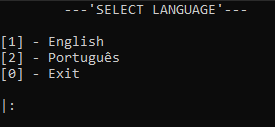
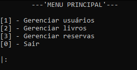
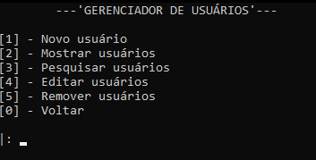
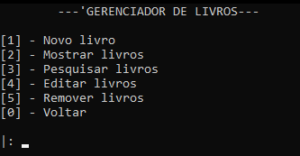
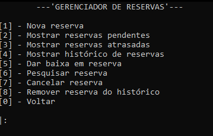

# Projeto Biblioteca

Projeto que simula de maneira simples o funcionamento de uma biblioteca. Estudo realizado utilizando Java. O sistema foi realizado de modo a concretizar alguns conceitos de POO, sendo iniciado de maneira simples, com apenas alguns cadastros, e logo depois foram incrementadas funcionalidades ao projeto neste repositório.

---

# Funcionalidades

O projeto proporciona uma série de `CRUDs` com o objetivo de simular algumas atividades presentes em bilbiotecas. Dentre as funcionalidades encontra-se:

- Escolha de idioma(inglês e portugûes)
- Menus 'interativos'
- Cadastro de usuários
- Cadastro de livros
- Cadastro de reservas
- Edição de usuários
- Edição de livros
- Edição de reservas
- Remoção de usuários
- Remoção de livros
- Remoção de reservas
- Função de dar baixa em reserva
- Função de cancelar reserva
- Função de exibir histórico de reservas
- Função de visualizar reservas pendentes e atrasadas

---

# Tecnologias Utilizadas

O projeto foi inteiramente feito em `Java`, utilizando o `Visual Studio Code` com extenções próprias para a linguagem. Pode-se elencar algumas tecnologias usadas:

- Manipulação de arquivos binários.
- Utilização de classes.

---

# Exemplos gráficos

Abaixo é possível analisar algumas imagens dos principais menus do projeto, exemplificando também algumas de suas funções.

Menu de seleção de idioma:



Menu principal:



Gerenciador de usuários:



Gerenciador de livros:



Gerenciador de reservas:



---

# Como compilar e rodar

Para rodar o projeto é necessário instalar o `jdk` e instalar também a pasta do projeto. No diretório `src` rode pelo terminal:

```bash
javac App.java && java App
```
ou se preferir

```bash
javac App.java
java App
```
